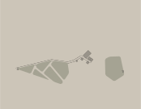
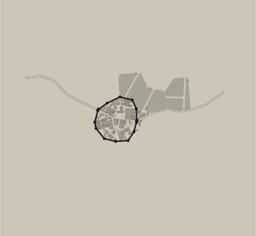
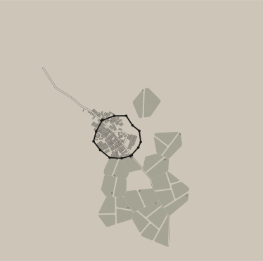
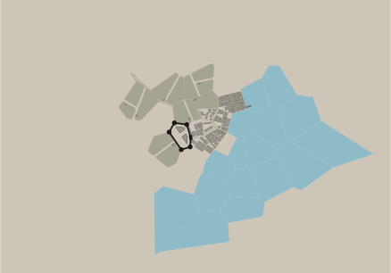

# Settlemaker

A medieval fantasy settlement map generator for Node.js. TypeScript reimplementation of [watabou's Medieval Fantasy City Generator](https://watabou.itch.io/medieval-fantasy-city-generator).

<p align="center">
  
  
  
  
</p>

## Features

- **Procedural settlement generation** from hamlets (pop 10) to metropolises (pop 200k+)
- **Deterministic output** — same seed always produces identical results
- **Zero runtime dependencies** — all algorithms ported directly (Voronoi, A\*, polygon operations, PRNG)
- **SVG and GeoJSON output** — render to vector graphics or geospatial features
- **Tile-ready** — built-in SVG-to-tile slicing for map integration
- **8 colour palettes** — default, blueprint, black & white, ink, night, ancient, colour, simple

### Settlement features

- Walled cities with towers and gates
- Citadels, castles, markets, temples, parks
- Ward types: craftsmen, merchants, patriciate, slums, administration, military
- Road networks connecting gates to the city center
- **Farmlands** with strip fields, furrows, and farmstead buildings
- **Harbour/dock wards** with warehouses and piers for port cities
- Sinusoidal farm/wilderness boundary for organic countryside

## Installation

```bash
npm install settlemaker
```

## Quick start

```typescript
import { generateFromBurg } from 'settlemaker';

const result = generateFromBurg({
  name: 'Thornwall',
  population: 5000,
  port: false,
  citadel: true,
  walls: true,
  plaza: true,
  temple: true,
  shanty: false,
  capital: false,
});

// result.svg    — SVG string
// result.geojson — GeoJSON FeatureCollection
// result.model  — raw Model for further inspection
```

### With a custom seed

```typescript
const result = generateFromBurg(burg, { seed: 42 });
```

### Port cities

```typescript
const result = generateFromBurg({
  name: 'Harborton',
  population: 12000,
  port: true,
  citadel: true,
  walls: true,
  plaza: true,
  temple: true,
  shanty: false,
  capital: false,
  oceanBearing: 180,      // ocean to the south
  harbourSize: 'large',   // large harbour with more piers
  roadBearings: [0, 90, 270],  // roads from N, E, W
});
```

### Custom palettes

```typescript
import { generateFromBurg, PALETTES } from 'settlemaker';

const result = generateFromBurg(burg, {
  svg: { palette: PALETTES.night },
});
```

Available palettes: `default`, `blueprint`, `bw`, `ink`, `night`, `ancient`, `colour`, `simple`.

## Lower-level API

For full control over the generation pipeline:

```typescript
import { GenerationParams, Model, generateSvg, generateGeoJson } from 'settlemaker';

const params = new GenerationParams({
  seed: 42,
  nPatches: 15,
  plazaNeeded: true,
  citadelNeeded: true,
  wallsNeeded: true,
});

const model = new Model(params).generate();
const svg = generateSvg(model);
const geojson = generateGeoJson(model);
```

## Input mapping

The `AzgaarBurgInput` interface maps from [Azgaar's Fantasy Map Generator](https://azgaar.github.io/Fantasy-Map-Generator/) burg data:

| Field | Type | Description |
|-------|------|-------------|
| `name` | `string` | Settlement name |
| `population` | `number` | Population count (drives patch count and ward distribution) |
| `port` | `boolean` | Is this a port settlement? |
| `citadel` | `boolean` | Has a citadel/castle |
| `walls` | `boolean` | Has defensive walls |
| `plaza` | `boolean` | Has a central plaza/market |
| `temple` | `boolean` | Has a temple/cathedral |
| `shanty` | `boolean` | Has shanty town areas |
| `capital` | `boolean` | Is a regional capital |
| `culture` | `string?` | Culture name (future use) |
| `roadBearings` | `number[]?` | Compass bearings of approaching roads |
| `oceanBearing` | `number?` | Bearing to nearest ocean (enables coastline) |
| `harbourSize` | `'large' \| 'small'?` | Harbour scale for port cities |

Population determines settlement size:

| Population | Type | Patches |
|-----------|------|---------|
| < 100 | Hamlet | 3-4 |
| 100 - 1,000 | Village | 5-9 |
| 1,000 - 5,000 | Town | 10-15 |
| 5,000 - 20,000 | City | 16-25 |
| 20,000 - 100,000 | Large city | 26-36 |
| > 100,000 | Metropolis | 36+ |

## Architecture

Three-layer pipeline:

1. **Input mapping** — `AzgaarBurgInput` to `GenerationParams`
2. **Generation core** — 6-phase pipeline:
   - Build Voronoi patches
   - Optimize junctions
   - Build walls
   - Classify water + place harbour
   - Build streets (A\* pathfinding)
   - Create wards + build geometry (farmlands, buildings, alleys)
3. **Output rendering** — SVG string builder, GeoJSON feature builder, tile slicer

All geometry algorithms (Voronoi via Bowyer-Watson, polygon cutting, oriented bounding box, PRNG) are implemented from scratch with no external dependencies.

## Development

Requires [Nix](https://nixos.org/) with flakes:

```bash
nix develop

# Run tests
npx vitest run

# Run smoke test
npx tsx smoke-test.ts

# Type check
npx tsc --noEmit
```

## License

GPL-3.0 — same as the [original Haxe implementation](https://github.com/watabou/TownGeneratorOS).
