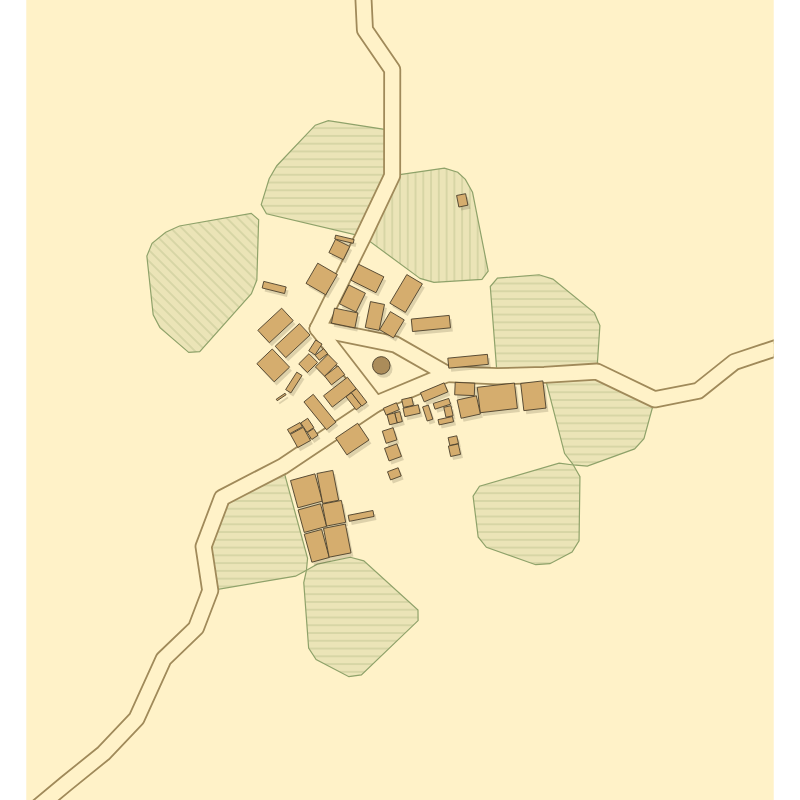
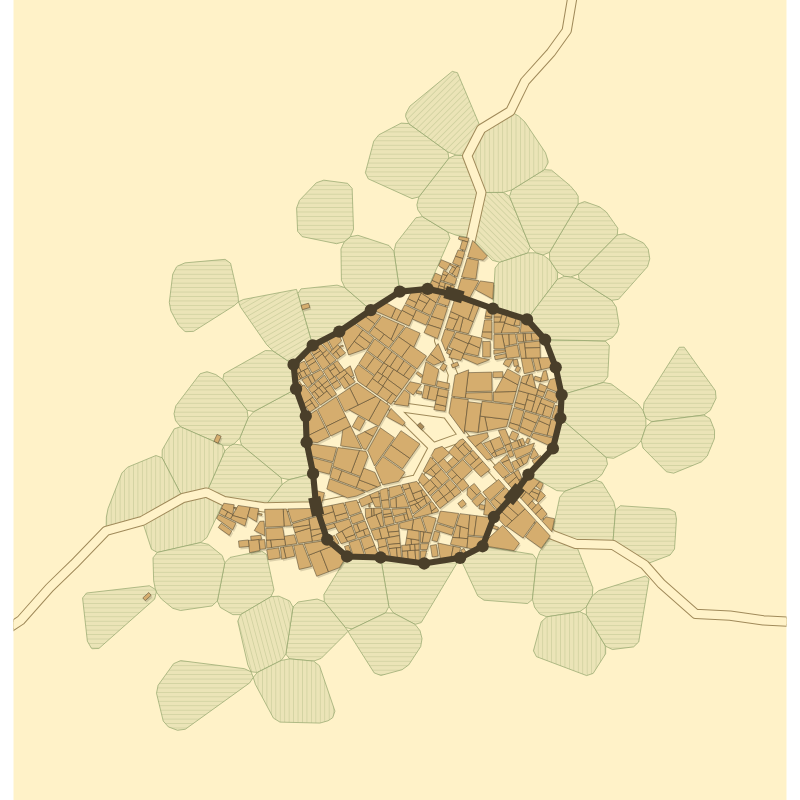
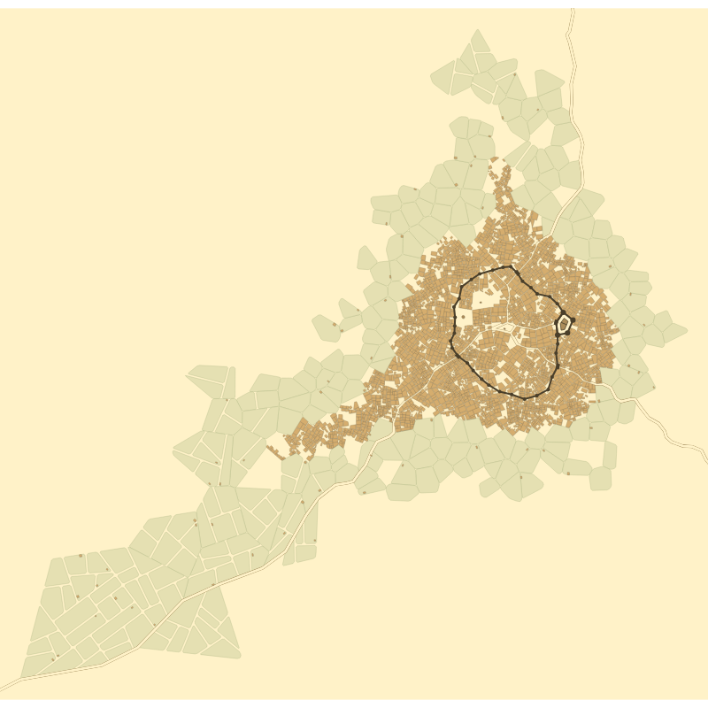
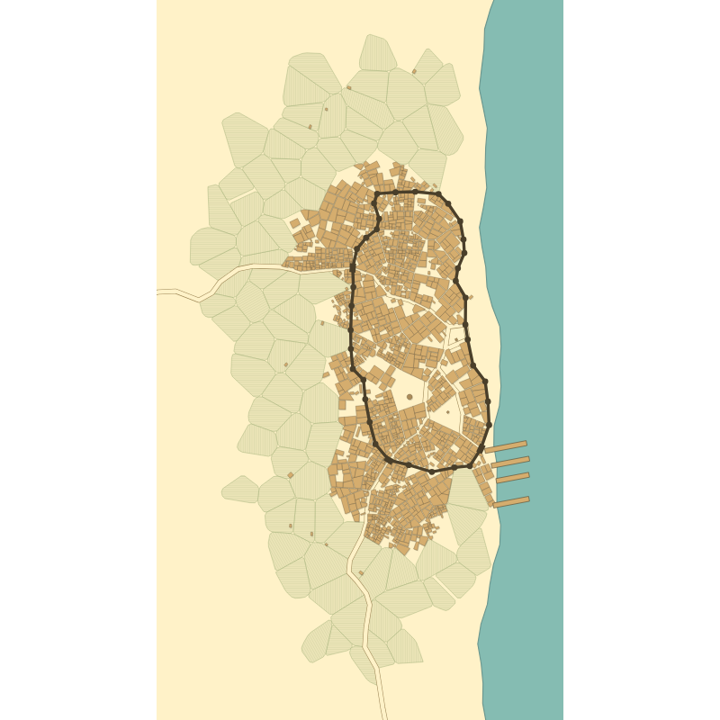
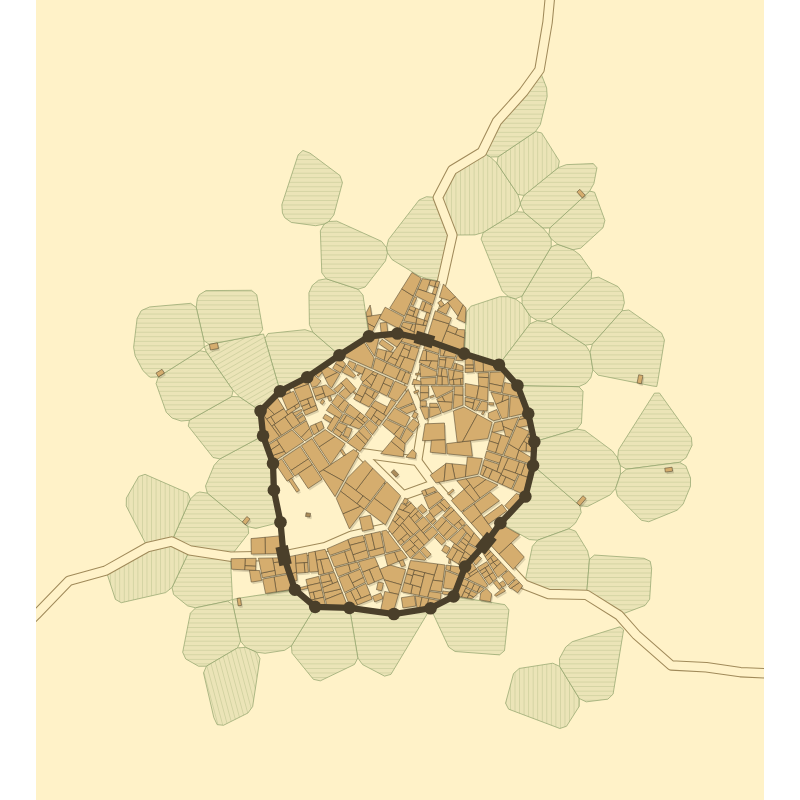
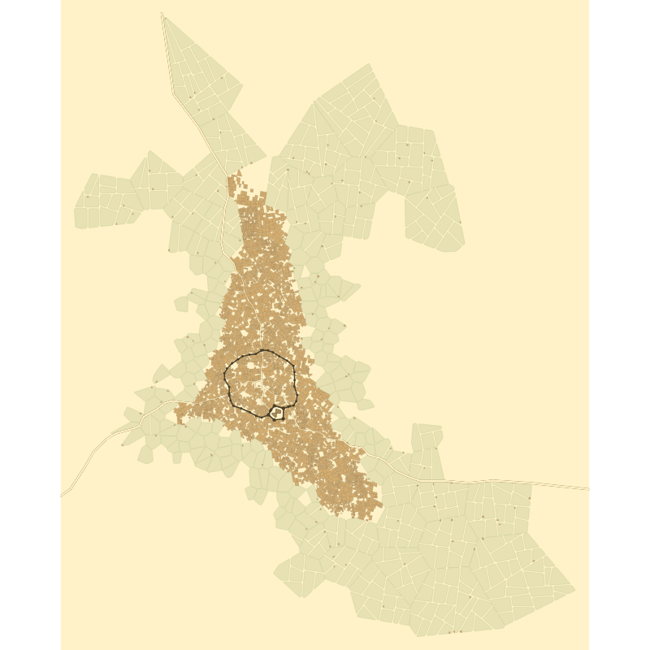
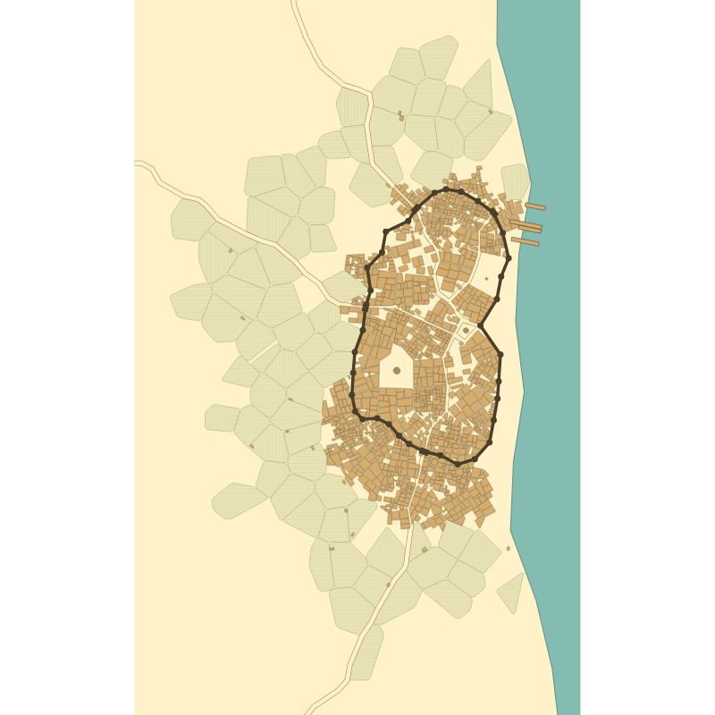
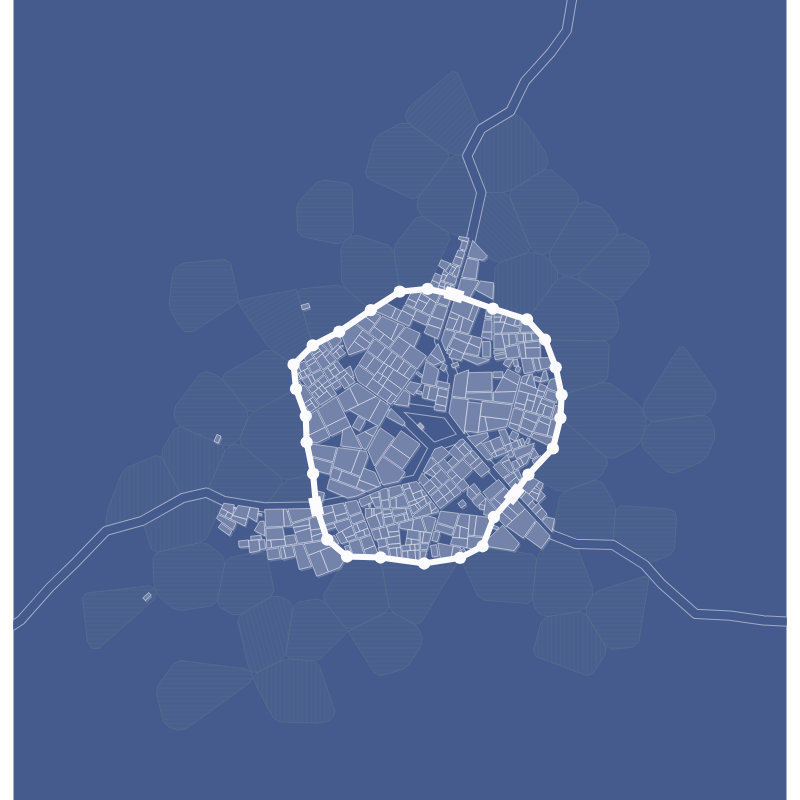
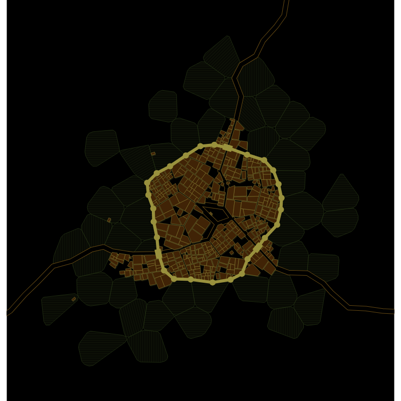
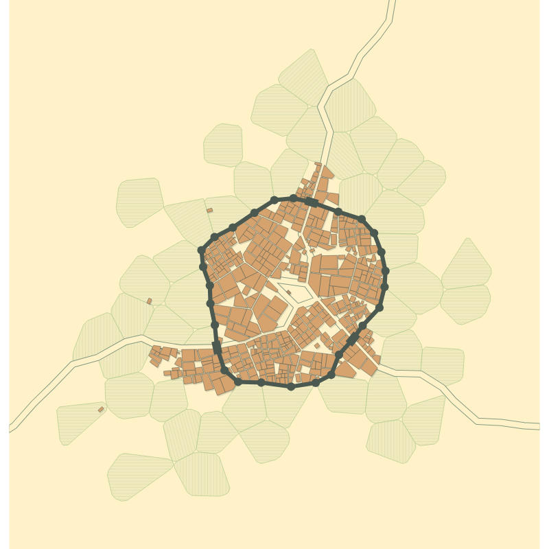

# Settlemaker

A medieval fantasy settlement map generator for Node.js. TypeScript reimplementation of [watabou's Medieval Fantasy City Generator](https://watabou.itch.io/medieval-fantasy-city-generator).

<p align="center">
  
  
  
  
</p>
<p align="center">
  
  
  
</p>
<p align="center">
  
  
  
</p>
<p align="center"><sub>Hamlet · walled town · city · port — the contract showcases (route-driven growth, walled-core capacity, full coastal) — and the same walled town in <code>blueprint</code>, <code>night</code>, and <code>colour</code> themes: identical layout, only colors change. Every image regenerates from <a href="docs/test-urls.md">documented example URLs</a> via <code>scripts/generate-examples.ts</code>.</sub></p>

## Features

- **Procedural settlement generation** from hamlets (pop 10) to metropolises (pop 200k+)
- **Deterministic output** — same seed always produces identical results
- **Zero runtime dependencies** — all algorithms ported directly (Voronoi, A\*, polygon operations, PRNG)
- **SVG and GeoJSON output** — render to vector graphics or geospatial features
- **Tile-ready** — built-in SVG-to-tile slicing for map integration
- **8 colour palettes** — default, blueprint, black & white, ink, night, ancient, colour, simple

### Settlement features

- Walled cities with towers and gates
- Citadels, castles, markets, temples, parks
- Ward types: craftsmen, merchants, patriciate, slums, administration, military
- Road networks connecting gates to the city center
- **Farmlands** with strip fields, furrows, and farmstead buildings
- **Harbour/dock wards** with warehouses and piers for port cities
- Farm belts hug the built edge; growth outside the walls follows route quality and terrain

## Installation

```bash
npm install settlemaker
```

## Quick start

```typescript
import { generateFromBurg } from 'settlemaker';

const result = generateFromBurg({
  name: 'Thornwall',
  population: 5000,
  port: false,
  citadel: true,
  walls: true,
  plaza: true,
  temple: true,
  shanty: false,
  capital: false,
});

// result.svg    — SVG string
// result.geojson — GeoJSON FeatureCollection
// result.model  — raw Model for further inspection
```

### With a custom seed

```typescript
const result = generateFromBurg(burg, { seed: 42 });
```

### Villages

Settlements of 1,000 people or fewer are drawn by a separate engine — roads
first, then the buildings that line them — rather than by the city pipeline.
`generateSettlement` picks the engine from the population and tells you which
one ran:

```typescript
import { generateSettlement } from 'settlemaker';

const result = generateSettlement({ name: 'Ashford', population: 400, /* ... */ });

if (result.kind === 'village') {
  result.svg;      // village SVG
  result.geojson;  // village GeoJSON
  result.model;    // VillageModel
} else {
  result.model;    // Model, as generateFromBurg returns
}
```

The boundary is `VILLAGE_POP_CEILING` (1,000), inclusive. Both branches emit an
SVG and a GeoJSON carrying the same `schema_version` and `settlemaker_version`
metadata, so a consumer can treat the two uniformly.

Village-only options go under `village`, settlement-only options under `svg` and
`geojson`; the compiler rejects an option the chosen engine cannot honour rather
than dropping it silently.

```typescript
generateSettlement(burg, { village: { theme: villageThemeFor('desert') } });
```

Village roads use existing frontage before adding streets. Small settlements can
stay as a green and a short access lane; larger ones add streets only when they
provide useful housing capacity. Regional approaches retain their bearings and inbound classes, then join
town, local or footpath streets inside villages. Small roadside hamlets can
retain a major through road. FMG supplies each measured approach explicitly;
`through` does not invent an exit. Local surfaces, reserved corridors and parcel setbacks are distinct
([width semantics](docs/schema-v3.md#village-road-cross-sections)).

Run `npm run review:roads` to generate the local road gallery. The
[road design report](docs/plans/2026-09-10-village-road-results.md) includes commands
for matched historical comparisons, held-out seeds and validation results. The
[follow-up review](docs/plans/2026-09-10-village-followup.md) covers road-shaped greens,
landmark locations, junction transitions and the expanded landscape panel. The
[route layout review](docs/plans/2026-09-10-village-route-layout.md) covers the
shared street network, updated FMG contract and varied multi-approach gallery.
The [water and roofs review](docs/plans/2026-09-10-village-water-roofs.md)
covers dry road approaches, timber bridges and native tundra dwellings.

Villages are themed by biome — `villageThemeFor(biome)` selects the ground,
vegetation and dwelling glyphs. The review gallery includes desert and tundra
examples, with native snowy dwelling artwork for tundra villages.

See the [2.6.0 release notes](docs/releases/2.6.0.md) for measured village water,
river meanders, temple henges and woodland. The [water-context v1 contract](docs/water-context-v1.md)
defines the coordinated FMG rollout.

See the [2.5.0 release notes](docs/releases/2.5.0.md) for city layouts, capacity
accounting and the settlemaker-web submodule update.

### Port cities

```typescript
const result = generateFromBurg({
  name: 'Harborton',
  population: 12000,
  port: true,
  citadel: true,
  walls: true,
  plaza: true,
  temple: true,
  shanty: false,
  capital: false,
  oceanBearing: 180,      // ocean to the south
  harbourSize: 'large',   // large harbour with more piers
  roadBearings: [0, 90, 270],  // roads from N, E, W
});
```

### Custom palettes

```typescript
import { generateFromBurg, PALETTES } from 'settlemaker';

const result = generateFromBurg(burg, {
  svg: { palette: PALETTES.night },
});
```

Available palettes: `default`, `blueprint`, `bw`, `ink`, `night`, `ancient`, `colour`, `simple`.

## Lower-level API

For full control over the generation pipeline:

```typescript
import { GenerationParams, Model, generateSvg, generateGeoJson } from 'settlemaker';

const params = new GenerationParams({
  seed: 42,
  nPatches: 15,
  plazaNeeded: true,
  citadelNeeded: true,
  wallsNeeded: true,
});

const model = new Model(params).generate();
const svg = generateSvg(model);
const geojson = generateGeoJson(model);
```

## Input mapping

The `AzgaarBurgInput` interface maps from [Azgaar's Fantasy Map Generator](https://azgaar.github.io/Fantasy-Map-Generator/) burg data:

| Field | Type | Description |
|-------|------|-------------|
| `name` | `string` | Settlement name |
| `population` | `number` | Population count (drives patch count and ward distribution) |
| `port` | `boolean` | Is this a port settlement? |
| `citadel` | `boolean` | Has a citadel/castle |
| `walls` | `boolean` | Has defensive walls |
| `plaza` | `boolean` | Has a central plaza/market |
| `temple` | `boolean` | Has a temple/cathedral |
| `shanty` | `boolean` | Has shanty town areas |
| `capital` | `boolean` | Is a regional capital |
| `culture` | `string?` | Culture name (future use) |
| `biome` | `string?` | Biome name. Azgaar's own vocabulary is accepted and normalised (`hot desert` → desert, `taiga` → tundra, …). In a village this is **data, not styling**: it picks the ground, the dwellings, the field and canopy decks and the plot edges. To change only the look, pass a `VillageTheme` — see [Villages](#villages) |
| `roadBearings` | `number[]?` | Compass bearings of approaching roads |
| `oceanBearing` | `number?` | Bearing to nearest ocean. Enables a coastline; in a village it synthesises one with bays and headlands, standing off the settlement |
| `harbourSize` | `'large' \| 'small'?` | Harbour scale for port cities |

Population determines settlement size. The patch counts below describe the
city pipeline; at 1,000 and under, `generateSettlement` uses the village
engine instead, which does not work in patches (see [Villages](#villages)):

| Population | Type | Patches |
|-----------|------|---------|
| < 100 | Hamlet | 3-4 |
| 100 - 1,000 | Village | 5-9 |
| 1,000 - 5,000 | Town | 10-15 |
| 5,000 - 20,000 | City | 16-25 |
| 20,000 - 100,000 | Large city | 26-36 |
| > 100,000 | Metropolis | 36+ |

## Architecture

Three-layer pipeline:

1. **Input mapping** — `AzgaarBurgInput` to `GenerationParams`
2. **Generation core** — 6-phase pipeline:
   - Build Voronoi patches
   - Optimize junctions
   - Build walls
   - Classify water + place harbour
   - Build streets (A\* pathfinding)
   - Create wards + build geometry (farmlands, buildings, alleys)
3. **Output rendering** — SVG string builder, GeoJSON feature builder, tile slicer

All geometry algorithms (Voronoi via Bowyer-Watson, polygon cutting, oriented bounding box, PRNG) are implemented from scratch with no external dependencies.

## Development

Requires [Nix](https://nixos.org/) with flakes:

```bash
nix develop

# Run tests
npx vitest run

# Run smoke test
npx tsx smoke-test.ts

# Type check
npx tsc --noEmit
```

## License

**GPL-3.0-only** (`SPDX-License-Identifier: GPL-3.0-only`). Full text in [LICENSE](LICENSE);
attribution and provenance in [NOTICE](NOTICE).

settlemaker is a derivative work of [watabou's TownGeneratorOS](https://github.com/watabou/TownGeneratorOS),
which is GPL-3.0. Upstream grants no "or any later version" option, so settlemaker is
GPL-3.0-**only**, not `-or-later`.

settlemaker.com is built from the private settlemaker-web repo, which pins
this repo as a submodule and serves the library to browsers as a standalone
GPL artifact (`/lib/settlemaker.js`, built by `npm run build:lib`). This
repository is the library: generation core, symbols, tests, and tooling.

Two things are *not* covered by that license:

- **The SVG symbol library** (`symbols/`) is original artwork under
  [**CC BY 4.0 with a rendered-output exception**](symbols/LICENSE). **Maps you
  render with the symbols are yours and owe nothing** — no credit, no notice. Attribution
  applies only if you redistribute the *library itself* (the SVGs, the sprite, or a set
  derived from them), in which case credit the authors in
  [CREDITS](symbols/CREDITS). Contributions are accepted on those terms.
- **[Azgaar's Fantasy Map Generator](https://github.com/Azgaar/Fantasy-Map-Generator)** (MIT)
  consumes settlemaker at arm's length over the [URL API](docs/url-api.md). Separate programs
  exchanging data, not a combined work — neither license reaches into the other.
