# Gallery

These maps were generated with SettleMaker 3.0.1 through the public
`generateSettlement` API. PNG previews and full SVGs come from the same output.
The gallery covers all five built-in artwork biomes in both engines, plus Copperline.

[Exact inputs and seeds](examples/gallery/fixtures.json) · [Regenerate the gallery](development.md#documentation-checks)

Hosted preview links carry the saved inputs; the website's deployed generator may
differ from this package version. Skins are loaded by the library API, so the
Copperline examples link to their SVGs rather than an unsupported skin URL.

## Ashford — temperate village

Roads, individual homes, a green and cultivated fields.

Population **300** · seed **2** · engine **village**

[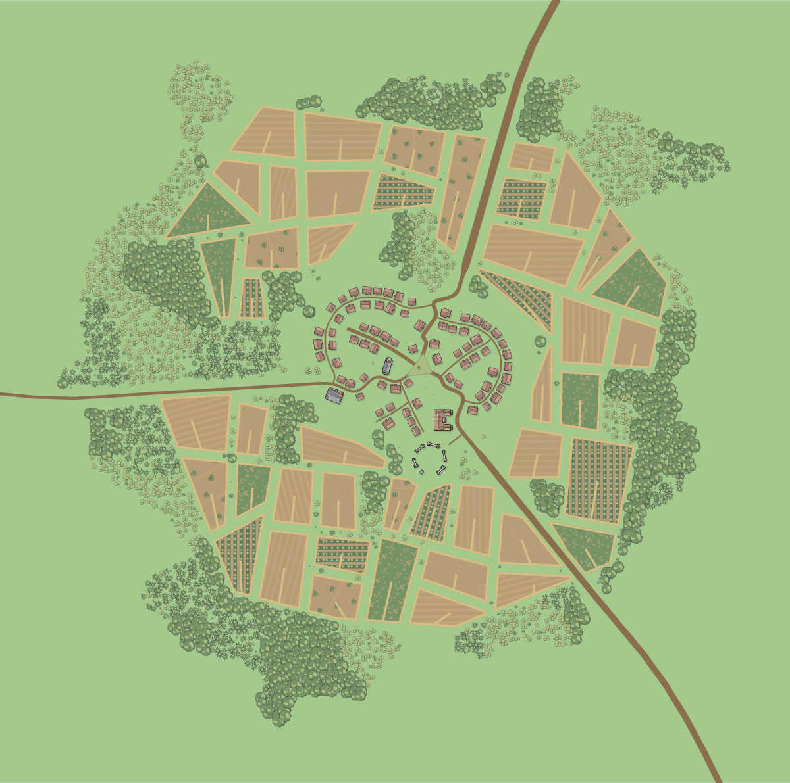](examples/gallery/temperate-village.svg)

[Full SVG](examples/gallery/temperate-village.svg) · [Hosted preview](https://settlemaker.com/fmg?i=dZDLasMwEEX_5a5VSNzSBO3a3yghTKJJLCpLQhrXtCb_3nEeDg10pyvuORrNiC_YpcGuL0fYETkVgT1QqGyw90KOw5wHCqHOKQf6IVgpvQbhLge-pdpSlO-7h7Ka7p6SyL0zFR-PqvsYsbuErWMdYrk2-PTRwaIjHzH1e-Gtn26iztc-TQKczCP40sykpOGBrHr8j2xeVzMZ0l5H_YMOXOVKbgwidfpRvNX2kIrTZk65DyQ-RdjnxUKX6dO5Mi2FCwnri6jM6mpOvw)

## Thornwall — walled city

Native city buildings, denser central wards, greener outskirts and defensive walls.

Population **10000** · seed **2** · engine **settlement**

[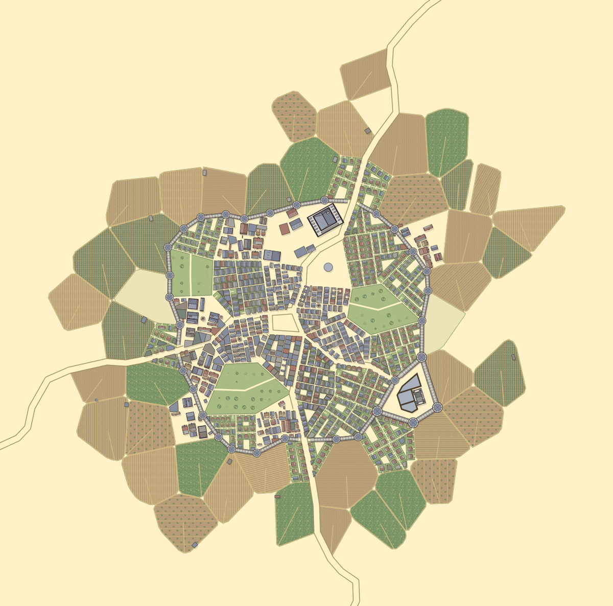](examples/gallery/temperate-city.svg)

[Full SVG](examples/gallery/temperate-city.svg) · [Hosted preview](https://settlemaker.com/fmg?i=dZDBasMwEET_Zc4qNKakRcd-Q24hmE28jUVkSUjrmNbk37tqa5cGqpNGzJsd7Ywr7MbgOOYz7IwUs8C-kS9scHJCHXtYyaPKibwvi0iePmgRwkPyvKjSU5D33xRKmrOm5EjdK1N24axh-xnHb9F2rA02LwYXFzpYDOQCqn8Ubl19CVquf6gBuJl78KlZSYnTHVn0-h_ZbJ9X0seTNv2DTlzkhzwYBBr0n9j1MYe6D_WmmEZP4mLQFo96dJsuftnqXjiTsE5FYda85vYJ)

## Qasra — desert village

Desert buildings, sparse vegetation and irrigated field textures.

Population **300** · seed **2** · engine **village**

[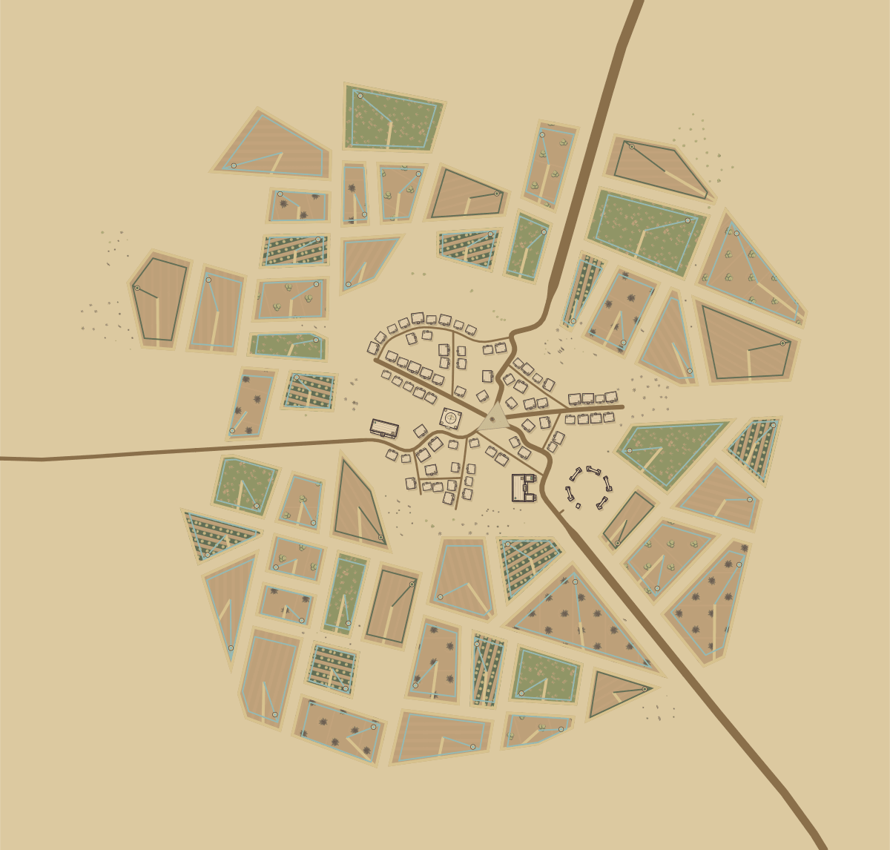](examples/gallery/desert-village.svg)

[Full SVG](examples/gallery/desert-village.svg) · [Hosted preview](https://settlemaker.com/fmg?i=dZDBasMwEET_Zc4KJE5oi479g55LMJtom4jKkpDWNa3xv3fdJg4N9KYR84bZGfEBuzE49OUEOyKnIrBvFCobHL2Q47DogUKoi8qBvghWSq9CuMuBr6qeKcrnLYeyJt1ySiL3zFR8PGnc64jDr2gda4nNk8G7jw4WHfmI2d8Lt37-idrvvJoDMJl7cNcspKThjqz6_I9sHh4XMqSjVv2DDlzlQu4NInV6KF6oFlJfTrkPJD5F2O16rVP69GNwXFnHnHQOZo1ppm8)

## Qasr — desert city

Urban desert architecture, religious buildings and courtyards.

Population **10000** · seed **2** · engine **settlement**

[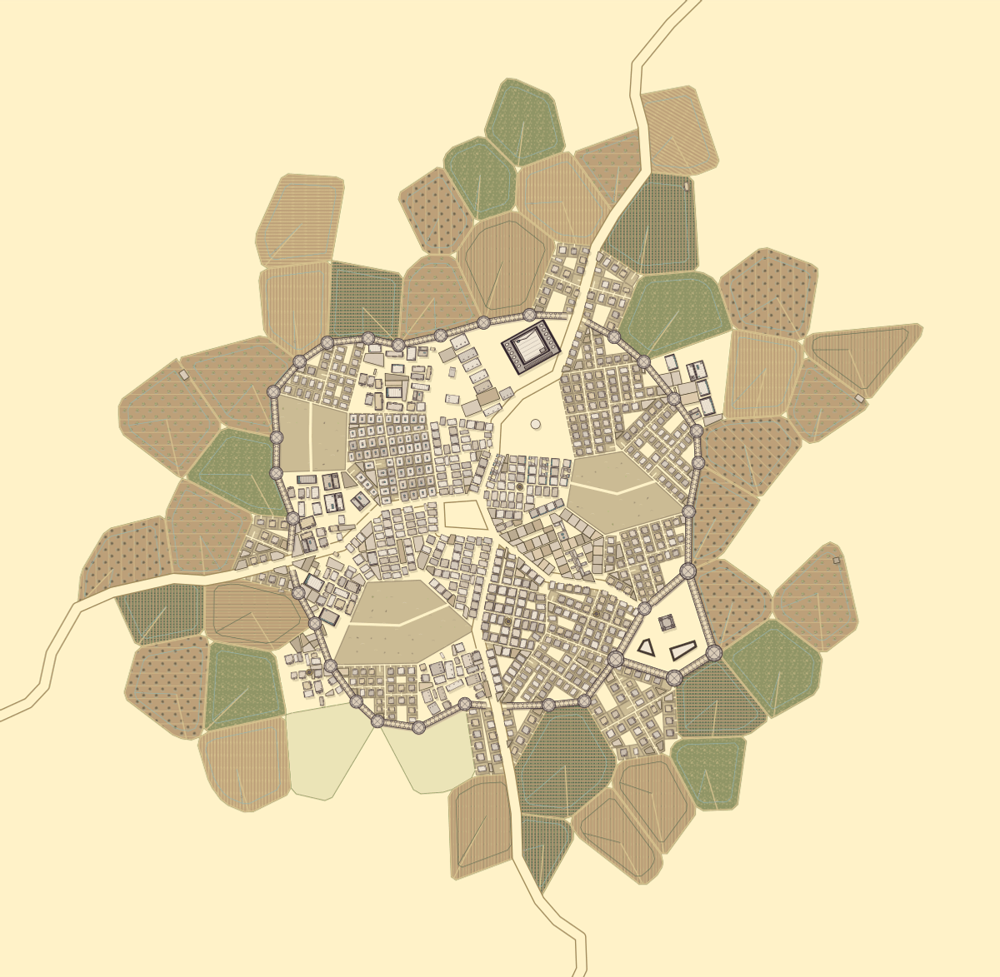](examples/gallery/desert-city.svg)

[Full SVG](examples/gallery/desert-city.svg) · [Hosted preview](https://settlemaker.com/fmg?i=dZBRi8IwEIT_yz5HOIt4kkf_gc8iZTV7GtwmIdlatPS_u7279jjBPGXCfMNkeriBXRo4tvkMtocUs4D9Qi5k4OQFHTFYya3KDpnLJBLjAych1CSmSZULBrn_pWDSHJ51jui2hNmHs6btezj-iNqRVlhuDFx9cGChQR9g9LdCtR9fgra7LMYAGMwruKpmUmL3Qha9viOr9edMcjxp1X9oR0V-yYOBgI1-FHZYstpSTC2j-Bi0wIceXdLHb4ejQrrloHsQaU41PAE)

## Snowmere — tundra village

Snowy dwellings and low tundra vegetation with natural ground instead of arable fields.

Population **300** · seed **2** · engine **village**

[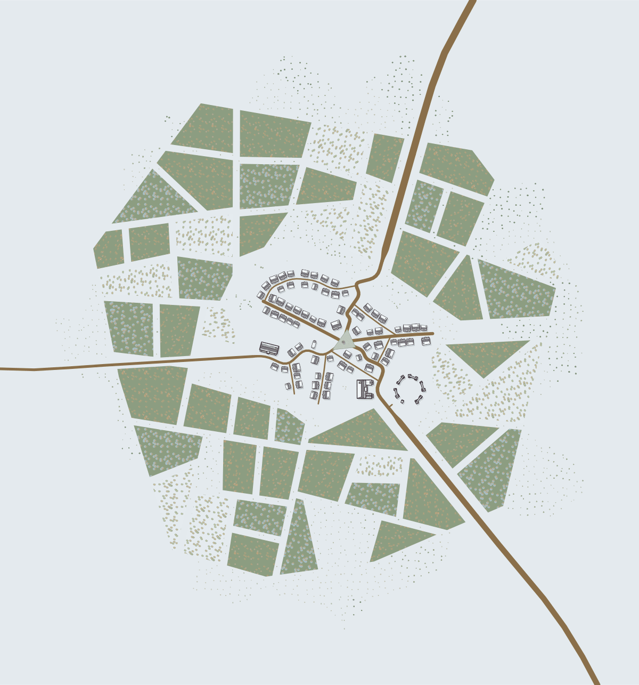](examples/gallery/tundra-village.svg)

[Full SVG](examples/gallery/tundra-village.svg) · [Hosted preview](https://settlemaker.com/fmg?i=dZDRTgIxEEX_5T7XBFaDpo_8go_GkIGO0NBtm3bqRjb8u7OgSyTxrbe553SmIz5hlwbbVvawI3IqAvtBobLBzgs5DnMeKIQ6pxzoRLBSmgbhPgf-TfVAUb5uHspqunlKIrdmKj7uVfc2YnsNG8c6xPLF4Oijg0VPPmLqN-GNn26iznd4mAQ4m3vwqZtJScMdWfX4H9mtnmcypJ2O-gcduMoP-W4QqddF8RrT0HNhreaUWyDxKcI-Lhb6mz5dOtKiK6TvoTKrqTt_Aw)

## Frosthold — tundra city

Northern roofs, fortifications and biome-specific ground.

Population **10000** · seed **2** · engine **settlement**

[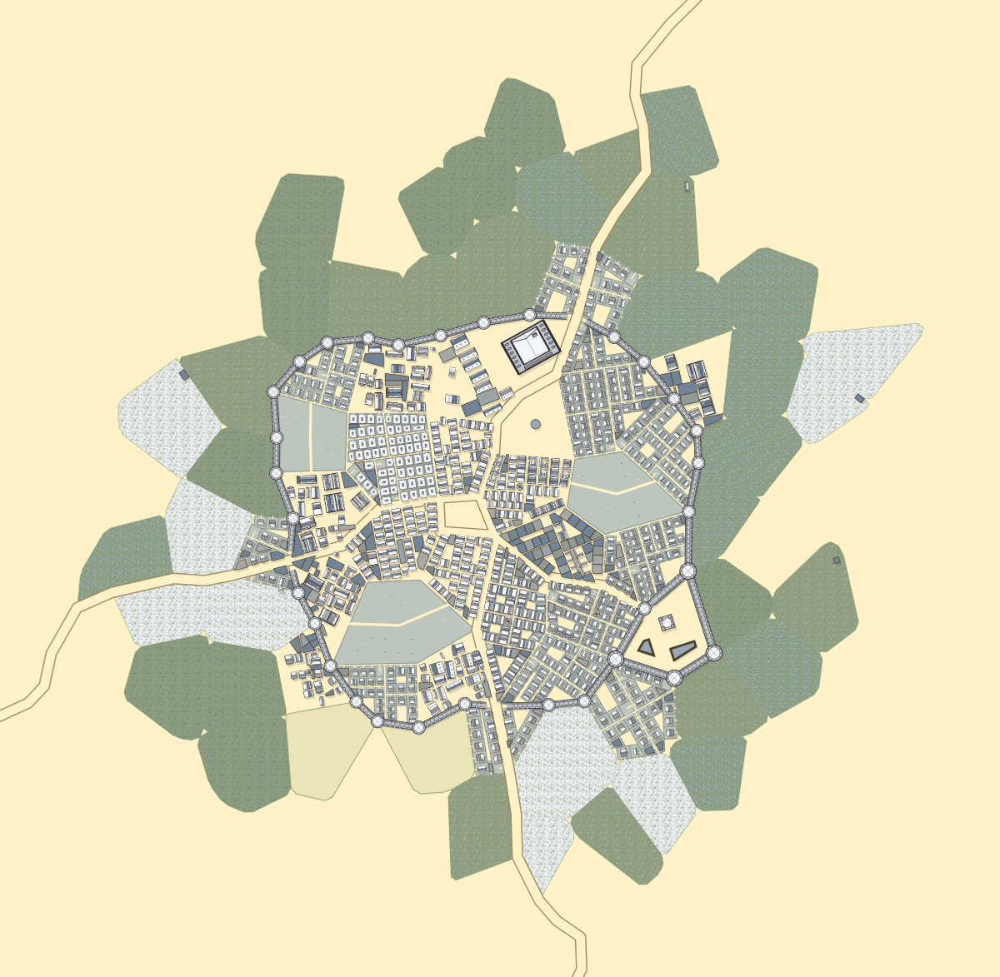](examples/gallery/tundra-city.svg)

[Full SVG](examples/gallery/tundra-city.svg) · [Hosted preview](https://settlemaker.com/fmg?i=dZDRTsMwDEX_xc9BYhUClEce-AmEJm_x1gg3jhKHCqr9O-6gnTaJPOVEPjc3meAT_MbBrpUj-AmyFAV_QK7kYB8VAzF4Lc1wROa6QGb8xgWUhsy0UO0x6dclBbPl8MpFMLwQlpiOlvY2we4XtoGswubZwUdMATwMGBPM801pG-eTZO36uzkATu5WfOhWU2W8Matt_zO7x6fVZNlb1St1pKp_5ruDhIM9FF6LVO2Fg81myY1RoyRrcW_LvjPKeUxbCgXtSqhEFtadfgA)

## Reedbank — tropical river village

A supplied river enables tropical paddy selection; fields follow real parcels.

Population **300** · seed **2** · engine **village**

[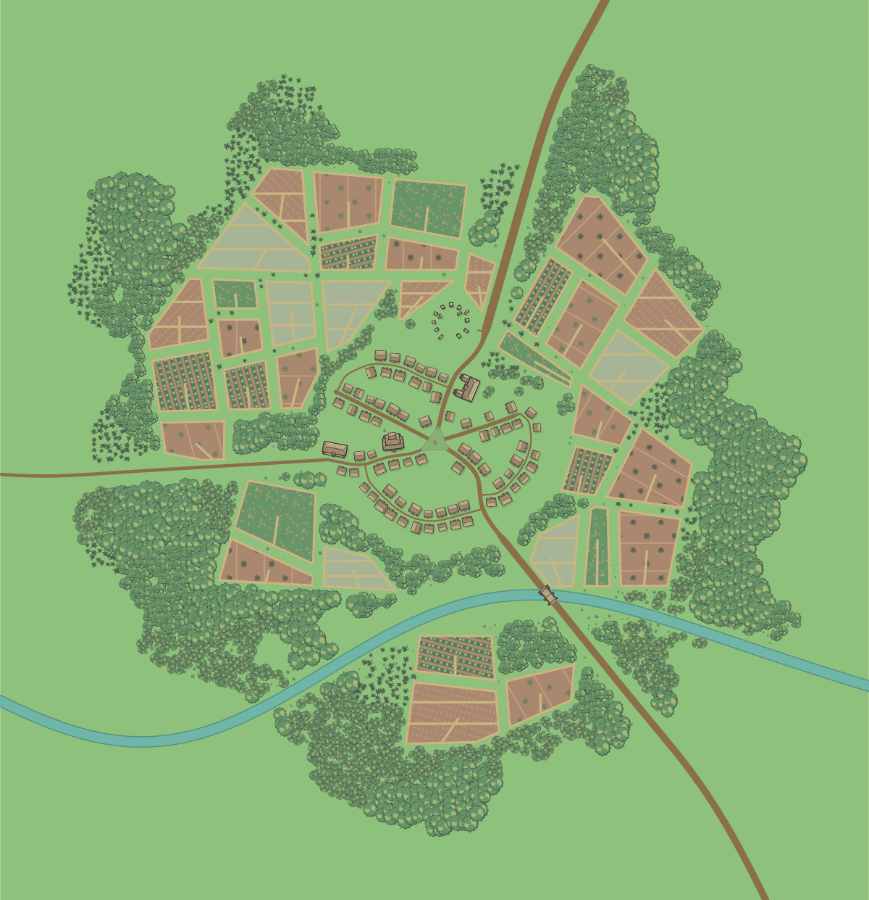](examples/gallery/tropical-village.svg)

[Full SVG](examples/gallery/tropical-village.svg) · [Hosted preview](https://settlemaker.com/fmg?i=dZBBT8MwDIX_i8-d1A0YkCP3XbiiaXIbs1pLkyhxV6Dqf8fdRgeTuPlZ_p6fPcARzLKAqkt7MAPEkATMO7pMBdQsaMnNukfn8qyiwy8EI6lTIdRGRz8qN-jl8-qDUZ2uPimgfSFM7Pdq9zZAdRY7Sxpi-VTAgb0FAy2yh2m-E9rx1PGar1lMBjAWt-D9aiYl9Ddk1vI_crV-nEkXao36B-0py4XcFuCx1UPhlchW6A86GkPsHAoHD-auLPWbHE4zkkLkix0fKZ2vrclLIseeTvIDzOJhovRhz-WUTTu_GrqyZyvNBsx63I76Xd2smcdv)

## Palmreach — tropical city

Tropical architecture and vegetation in the city engine.

Population **10000** · seed **2** · engine **settlement**

[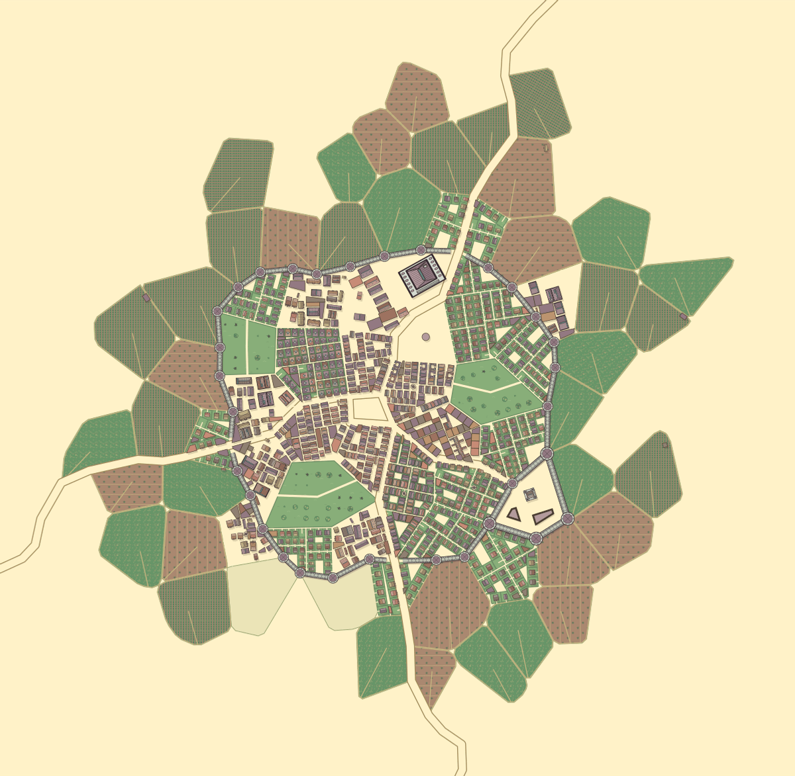](examples/gallery/tropical-city.svg)

[Full SVG](examples/gallery/tropical-city.svg) · [Hosted preview](https://settlemaker.com/fmg?i=dZDRisIwEEX_ZZ4jaBGVPPoFvouUsZ21wWkSkqllt_Tfne5uu6xgnnLDnMPNDPAAuzFw7dIN7AAxJAH7gZzJQOUEa2KwkjqNPTLnOUTGL5yDUBuZ5pQb9PL5Z8GoHl5yClgfCZPzN7WdB7j-hLImrbA5GLg7X4OFFp2Hab4TKt304rVds5oEMJpXcFsspIT-hcx6fUcWu_1Ccqi06j-0pyy_5MWAx1Y_CifkNhFWjc7GEDtGccFri7UeXacL32OSQnSTcdS1EKmuGJ8)

## Dunewick — coastal village

A generated coast from oceanBearing, with coastal buildings and vegetation.

Population **300** · seed **2** · engine **village**

[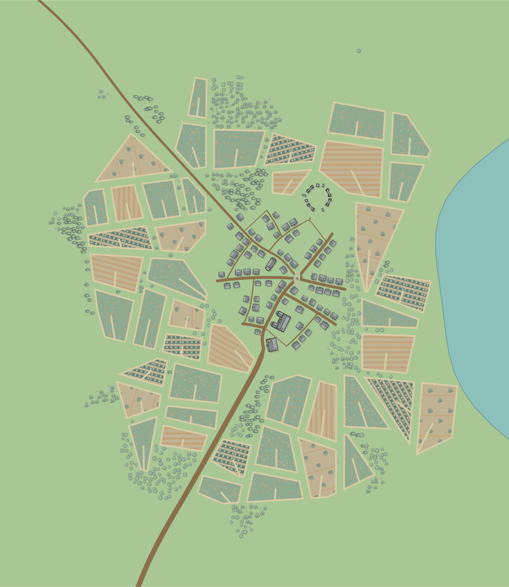](examples/gallery/coastal-village.svg)

[Full SVG](examples/gallery/coastal-village.svg) · [Hosted preview](https://settlemaker.com/fmg?i=XY_RbsIwDEX_xc9Bapn2sDyi_cU0ITfxICLEUepQbVX_fW6BIng8lu_x9QgXsK2BrpYD2BEyFwH7g7EnAy4IeoorDxhjv1KO-IdgpVQFoXOOdKf-iEl-Hx7Manp4CqPfEZaQDqr7GqG7wt6Tlti2jYFTSB4sCA8J5kAV2od54hh72cwGmMxL8q19X5ORnV58ivqaaJNRjjB9G0h41r7wqcMhuJOuZs41ogROqmq0RBd42VluLjZ2hOlWHexHM-mvRCrfTv8)

## Saltmouth — port city

Port infrastructure beside a generated coastline. This is a bearing-based coast, not a measured survey.

Population **12000** · seed **2** · engine **settlement**

[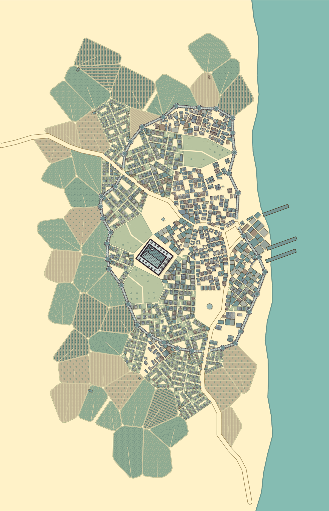](examples/gallery/coastal-city.svg)

[Full SVG](examples/gallery/coastal-city.svg) · [Hosted preview](https://settlemaker.com/fmg?i=RY69DsIwDITfxXOGUCYy8godEYNpTRvJjaP8gGjVd8dFFMY7n7-7BR7gDgZuNQ3gFoiSCriSKhnofMGeGNwdOat-InPej5Fxxl0UmiLTrvKIobx-bx1GBf0xSbA_EyYfBqVdGmvN0dqrgYCTMqBFLpPUMoK2SKyMxUvQlZq0utTLJ9YJ5g1rYMR0k5paP28-YxpIXekIw7cH3MmuOoyoB9esbw)

## Copperline — industrial village

The same village planner with a complete replacement skin and industrial artwork.

Population **250** · seed **2** · engine **village**

[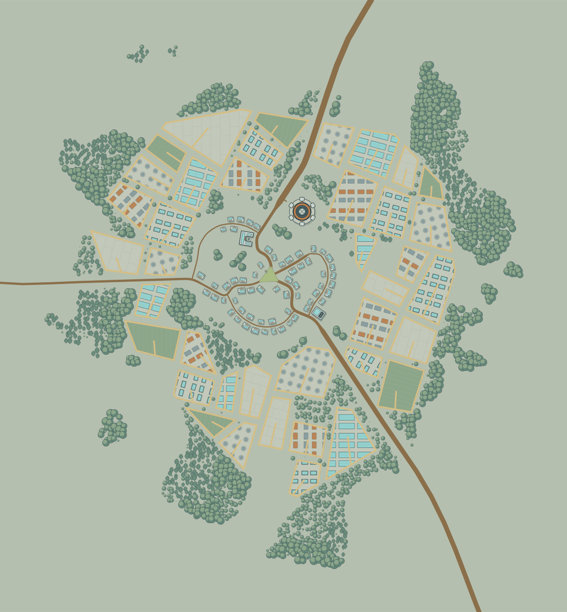](examples/gallery/copperline-village.svg)

[Full SVG](examples/gallery/copperline-village.svg) · [Skin JSON](examples/copperline.skin.json)

## Brassworks — steampunk city

Copperline machinery and brass materials on the existing city layout and semantic feature types.

Population **2000** · seed **2** · engine **settlement**

[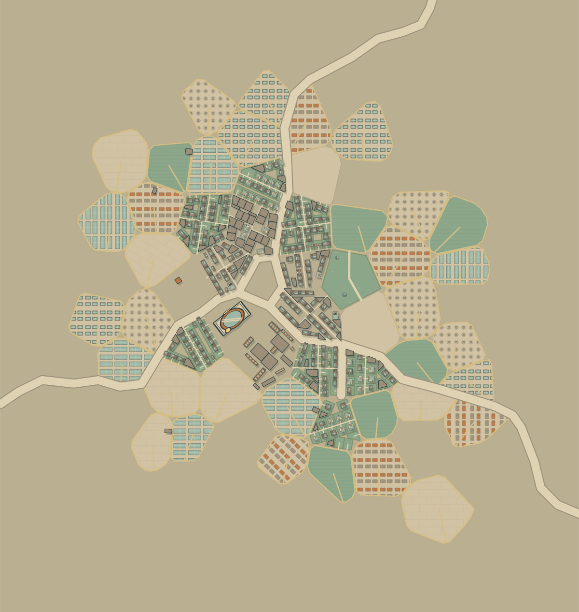](examples/gallery/copperline-city.svg)

[Full SVG](examples/gallery/copperline-city.svg) · [Skin JSON](examples/copperline.skin.json)

## One layout, another palette

Thornwall with the same inputs and seed, using `svg.palette: PALETTES.night`.
City palettes alter presentation; they do not replace all native material tokens.
Use a skin for complete artwork and material control.

[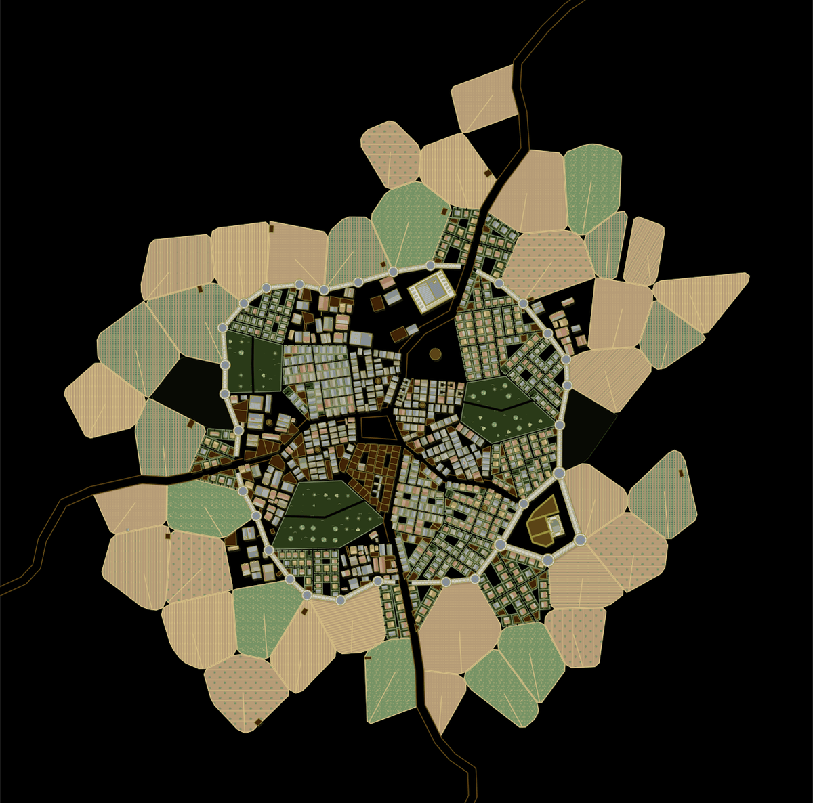](examples/gallery/temperate-city-night.svg)
