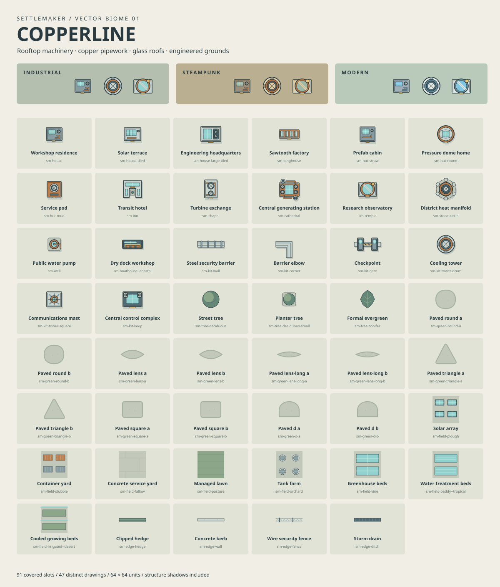

# Copperline

An original top-down SVG set for technologically advanced settlements. Flat roofs,
solar glazing, turbines, pressure vessels, rooftop ventilation and copper pipes
replace the bundled medieval architecture. All 91 skin slots are covered, using
47 distinct drawings and shared variants for the existing terrain biomes.



- [Portable skin JSON](../../docs/examples/copperline.skin.json): load with `createSkin`.
- [SVG sprite](symbols.svg): all engine slot IDs and structure silhouette twins.
- [Village example](../../docs/examples/copperline-village.svg).
- [City example](../../docs/examples/copperline-city.svg).

Three named biomes share the same artwork and temperate terrain behaviour:

| Biome | Materials | Additional names |
| --- | --- | --- |
| `industrial` | Cool steel, copper, turquoise glazing | `copperline`, `industrial district` |
| `steampunk` | Warm brass, bronze, cream, sage glazing | `brassworks`, `steam city` |
| `modern` | Pale concrete, blue steel, blue glazing | `technology park`, `modern city` |

```ts
import { createSkin, generateSettlement } from 'settlemaker';
import { readFile } from 'node:fs/promises';

const skin = createSkin(JSON.parse(await readFile('docs/examples/copperline.skin.json', 'utf8')));
const result = generateSettlement({ ...burg, biome: 'steampunk' }, { seed: 42, skin });
```

In a browser, fetch the JSON from your application's asset directory. The skin
also replaces artwork when used with the existing terrain biomes. There is no
automatic registration: pass the loaded skin to each generation request.

The engine retains its original layout, population rules, and semantic feature
IDs. For example, the `sm-cathedral` slot paints a generating station and
`sm-field-plough` paints solar arrays; their GeoJSON categories remain unchanged.
City walls and some roads, bridges, parks, and fallback buildings are generated
geometry. Village roads and bridges retain the renderer's default colours.
For the illustrated open industrial city, use `walls: false` and
`citadel: false` as in the example generator.

All drawings use the existing 64 × 64 placement boxes. House ink is inset to the
original frontage; structure silhouettes have no baked-in offset. Vegetation and
parcel artwork have no silhouettes. Field tiles repeat on both axes, barriers
and edge stamps along their local x-axis. Material colours have explicit SVG
fallbacks and can be overridden with the skin's `--cl-*` tokens.

Edit [the vector authoring script](../../scripts/generate-copperline.mjs), then:

```sh
node scripts/generate-copperline.mjs
npm run build
node scripts/render-copperline.mjs
```

The first command regenerates the JSON, sprite, and contact sheet; the last
validates slot/shadow coverage and renders all three presets through both engines,
saving the industrial village and city examples. Original artwork in this folder
and the Copperline JSON is distributed under the repository's [GPL-3.0-only licence](../../LICENSE).
